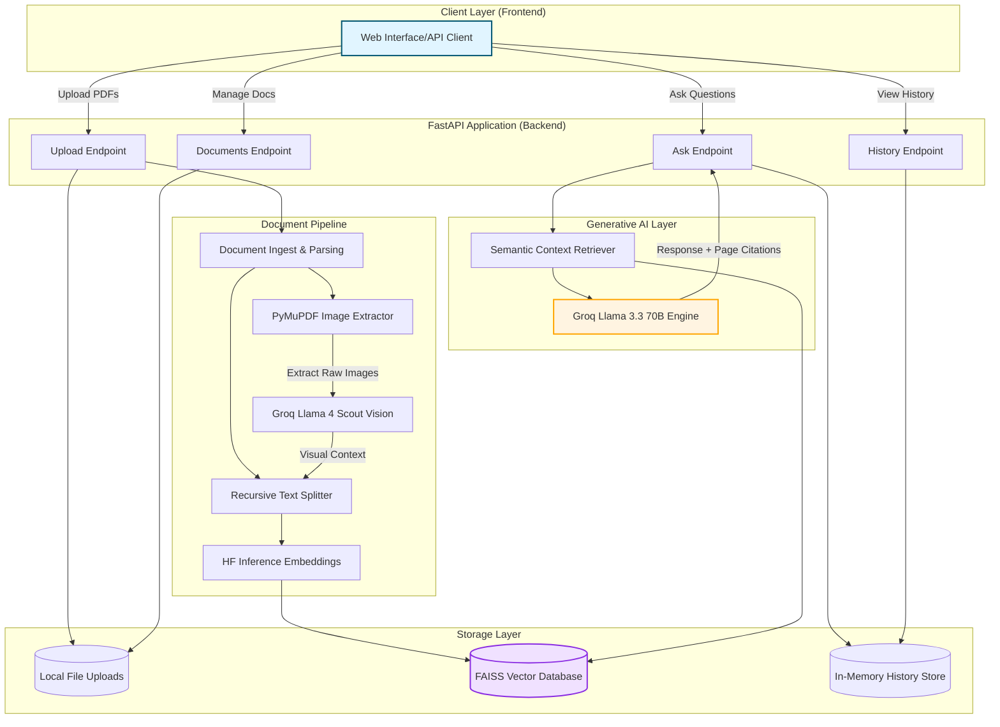

# 🔍 Premium Multimodal RAG Search Engine

> A high-performance, production-ready document search and question-answering system powered by Retrieval-Augmented Generation (RAG). Featuring multimodal vision processing, source citations, conversation history, and a modern dashboard UI.

<div align="center">

[](https://fastapi.tiangolo.com/)
[](https://www.python.org)
[](https://python.langchain.com/)
[](https://groq.com/)
[](https://github.com/facebookresearch/faiss)

</div>

---

## 🎯 Overview

This project implements a **multimodal PDF Question-Answering system** using Retrieval-Augmented Generation (RAG). Users can upload documents (PDF, TXT, MD, HTML), which are instantly processed, chunked, and indexed. In addition to extracting text, the engine automatically detects and extracts images (charts, tables, diagrams) from PDF pages, generates semantic descriptions using **Groq's Llama 4 Scout Vision** model, and indexes them alongside textual data.

When you ask a question, the system retrieves the most relevant textual and visual context to synthesize an accurate answer with **exact page-level citations**.

---

## ✨ Key Features

*   🖼️ **Multimodal Vision Indexing** — Automatically extracts embedded images from PDFs, generates descriptive summaries using `meta-llama/llama-4-scout-17b-16e-instruct` on Groq, and index-matches them. You can search for data inside charts, tables, and diagrams!
*   🗂️ **Multiple Document Support** — Upload and manage multiple files simultaneously. Search across your entire catalog or query specific documents.
*   🎯 **Verifiable Citations** — Every response includes exact references (source document name, page number, and content snippet) to eliminate hallucinations.
*   💬 **Premium Glassmorphic Interface** — An interactive, responsive web dashboard with a clean sidebar, file dropzone, audio transcriber interface, and modal context viewer.
*   ⚡ **API-Based Hybrid Embeddings** — Fast, lightweight deployment under 200MB using the HuggingFace Inference API (`all-MiniLM-L6-v2`), avoiding heavy local model downloads.
*   🔄 **Dual LLM Integrations** — Hot-swap between Groq (`llama-3.3-70b-versatile` for high-speed generation) and OpenAI (`gpt-3.5-turbo` or newer) via environment variables.

---

## 🏗️ System Architecture

### Component Diagram


---

## 📁 Repository Structure

```
RAG_Search_Engine/
├── backend/                  # Backend application directory
│   ├── main.py               # FastAPI application & REST routing
│   ├── rag.py                # LangChain & RAG chain implementation
│   ├── vision.py             # Image extraction & Llama Scout processing
│   ├── ingest.py             # Document ingest & vector-store compilation
│   ├── loaders.py            # Custom document loaders
│   ├── requirements.txt      # Python backend packages
│   ├── .env                  # Environment secrets (GROQ, HuggingFace keys)
│   ├── uploads/              # Raw document storage directory
│   └── data/
│       ├── faiss_index/      # Saved FAISS index binaries
│       └── images/           # Extracted image assets
│
├── frontend/                 # Frontend interface files
│   └── index.html            # Unified glassmorphic client application
│
├── Dockerfile                # Multi-stage production container build
├── render.yaml               # Deployment blueprint configuration
└── README.md                 # Project documentation
```

---

## 🚀 Quick Start

### Prerequisites
*   Python 3.11+
*   Groq API Key (Sign up for a free tier key at [Groq Console](https://console.groq.com))
*   HuggingFace API Key (Create an API Token at [HuggingFace Settings](https://huggingface.co/settings/tokens))

### 1. Installation
Clone the repository and set up a virtual environment:
```bash
git clone <your-repo-url>
cd RAG_Search_Engine

# Create virtual environment
python -m venv .venv

# Activate environment
# Windows:
.venv\Scripts\activate
# Linux/macOS:
source .venv/bin/activate
```

Install the backend dependencies:
```bash
pip install -r backend/requirements.txt
```

### 2. Configuration
Create a `.env` file inside the `backend/` directory:
```env
# backend/.env

# LLM Configuration (groq / openai)
LLM_PROVIDER=groq
GROQ_API_KEY=gsk_your_groq_api_key_here

# Embeddings API Key
HF_API_KEY=hf_your_huggingface_api_key_here

# Optional: OpenAI Settings
# LLM_PROVIDER=openai
# OPENAI_API_KEY=sk_your_openai_api_key_here
```

### 3. Run the Development Server
Launch the FastAPI backend from the root directory:
```bash
uvicorn backend.main:app --host 127.0.0.1 --port 8000 --reload
```

Once running, access the web client or interactive docs:
*   **Web Interface UI**: [http://127.0.0.1:8000/](http://127.0.0.1:8000/)
*   **Swagger API Docs**: [http://127.0.0.1:8000/docs](http://127.0.0.1:8000/docs)

---

## 📖 API Usage Guide

### 1. Document Upload
Upload single or multiple files (PDF, TXT, MD, HTML) to the engine:
```bash
curl -X POST "http://127.0.0.1:8000/upload" \
  -F "files=@invoice.pdf" \
  -F "files=@notes.txt"
```
**Response:**
```json
{
  "message": "Successfully uploaded 2 file(s)",
  "uploaded": [
    {"id": "6f4e6f73-5eb8-4cfd-978b-1795efa39967", "filename": "invoice.pdf"},
    {"id": "5ac9f8ba-bf48-410e-b0c3-08b648f88672", "filename": "notes.txt"}
  ],
  "total_documents": 2,
  "new_chunks_added": 42
}
```

### 2. Query Chat (Ask Questions)
Query the knowledge base using semantic search:
```bash
curl -X POST "http://127.0.0.1:8000/ask" \
  -H "Content-Type: application/json" \
  -d '{"question": "How much was charged on the invoice?"}'
```
**Response:**
```json
{
  "answer": "The invoice charges total $450.00 for consultancy services.",
  "sources": [
    {
      "content": "Invoice Summary:\nConsultancy: $450.00...",
      "metadata": {
        "source_file": "invoice.pdf",
        "page": 1
      }
    }
  ],
  "source_count": 1
}
```

### 3. File Operations
**List indexed files:**
```bash
curl http://127.0.0.1:8000/documents
```

**Delete a specific file (deletes chunks and rebuilds vector store):**
```bash
curl -X DELETE "http://127.0.0.1:8000/documents/6f4e6f73-5eb8-4cfd-978b-1795efa39967"
```

---

## 🔧 REST Endpoint Definitions

| Method | Endpoint | Payload | Description |
| :--- | :--- | :--- | :--- |
| `POST` | `/upload` | Multipart files | Upload and index documents |
| `POST` | `/ask` | `{"question": "..."}` | Submit query and retrieve answer with sources |
| `GET` | `/documents` | None | Fetch all active documents |
| `DELETE` | `/documents/{doc_id}` | Path parameter | Remove a document & rebuild the index |
| `GET` | `/history` | None | Fetch recent chat conversation list |
| `DELETE` | `/clear-history` | None | Clear the current user conversation history |
| `GET` | `/` | None | Serves the web interface dashboard |

---

## 🐋 Production Deployment (Docker)

To deploy the system inside a Docker container:
```bash
# Build the container image
docker build -t rag-search-engine .

# Run the container
docker run -p 8000:8000 -e GROQ_API_KEY="your_key" -e HF_API_KEY="your_key" rag-search-engine
```

The `Dockerfile` is optimized to execute in multi-stage environments like **Render**, **Fly.io**, or **AWS ECS**.

---

## 💡 Tech Stack References

*   **FastAPI** — High-performance python web framework.
*   **LangChain** — System orchestration and LLM prompt layout.
*   **FAISS (Facebook AI Similarity Search)** — Blazing-fast similarity lookup for vector indices.
*   **HuggingFace Inference API** — Converts raw text into vectors using `all-MiniLM-L6-v2`.
*   **Groq Cloud** — Hyper-fast execution of Llama 3.3 (Text) and Llama 4 Scout (Vision) models.

---

<div align="center">
Made with ❤️ using Python, FastAPI, and LangChain
</div>
