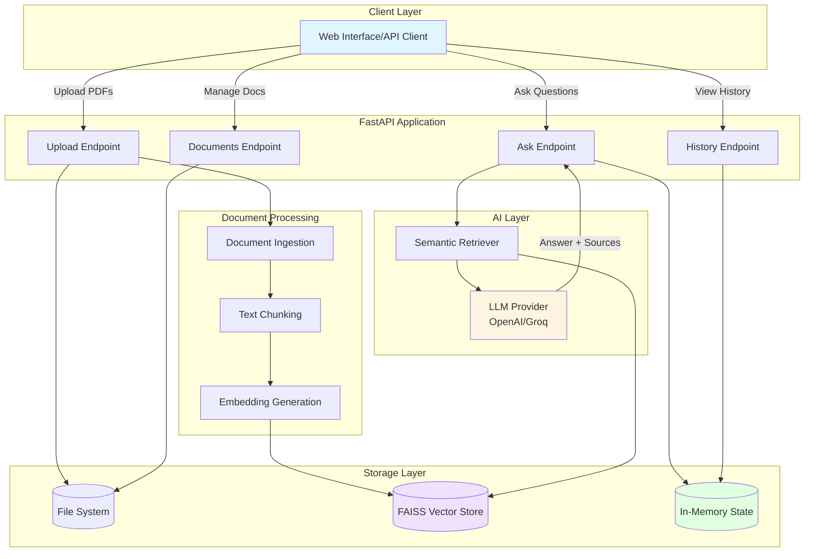
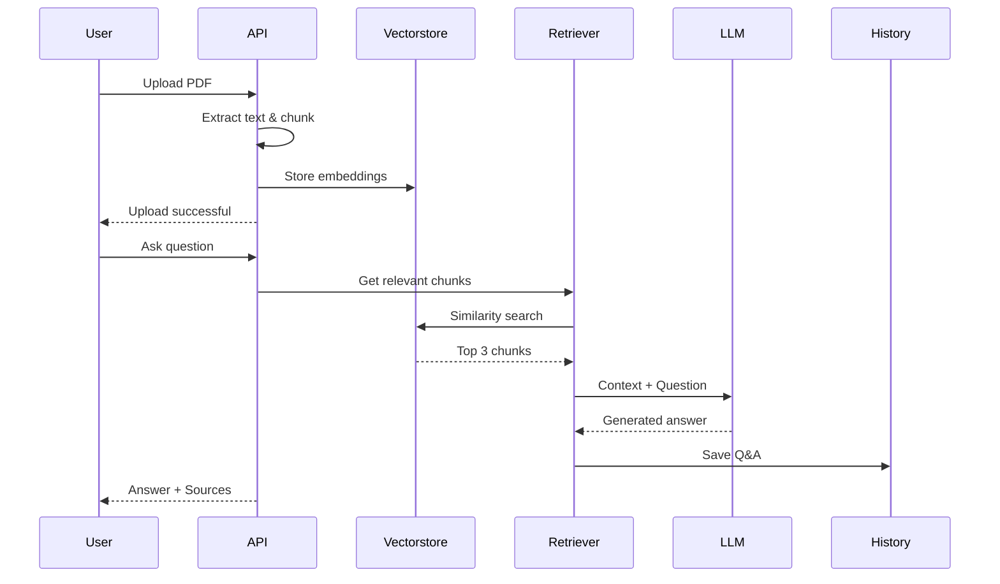
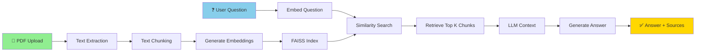

# 🔍 RAG Search Engine

> An intelligent document search and question-answering system powered by Retrieval-Augmented Generation (RAG), supporting multiple LLM providers and featuring source citation.

[](https://fastapi.tiangolo.com/)
[](https://www.python.org)
[](https://python.langchain.com/)
[](LICENSE)

---

## 🎯 Overview

This project implements a **production-ready PDF Question-Answering system** using Retrieval-Augmented Generation (RAG). Upload multiple PDF documents and ask questions - the system retrieves relevant context and generates accurate answers with **source citations**, showing exactly which document and page the answer came from.

### ✨ Key Features

- 🗂️ **Multiple Document Support** - Upload and manage entire document libraries
- 🎯 **Source Citation** - Every answer includes references to source documents and pages
- 💬 **Chat History** - Automatic conversation tracking with timestamps
- 🔄 **Dual LLM Support** - Switch between OpenAI and Groq seamlessly
- 📊 **Document Management** - List, upload, and delete documents via REST API
- ⚡ **Fast Retrieval** - FAISS vector store for efficient similarity search
- 🔍 **Semantic Search** - HuggingFace Inference API embeddings for accurate context retrieval
- 📦 **Lightweight Deployment** - Under 200MB total size (API-based embeddings)

---

## 🏗️ Architecture

### System Architecture



### RAG Pipeline Flow



### Data Flow



---

## 🚀 Quick Start

### Prerequisites

- Python 3.11 or higher
- Virtual environment (recommended)
- Groq API key (free tier available)
- HuggingFace API key (free tier available)

### Installation

1. **Clone the repository**
```bash
git clone <your-repo-url>
cd Pdf_RAG
```

2. **Create and activate virtual environment**
```bash
python -m venv .venv

# Windows
.venv\Scripts\activate

# Linux/Mac
source .venv/bin/activate
```

3. **Install dependencies**
```bash
pip install -r requirements.txt
```

4. **Configure environment variables**

Create a `.env` file in the project root:

```env
# Groq API Key (free tier available)
GROQ_API_KEY=your-groq-api-key-here

# HuggingFace API Key (free tier available)
# Used for lightweight API-based embeddings (<200MB deployment)
HF_API_KEY=your-huggingface-api-key-here
```

5. **Run the server**
```bash
uvicorn main:app --reload
```

6. **Access the API**
- API Documentation: http://127.0.0.1:8000/docs
- API Base URL: http://127.0.0.1:8000

---

## 📖 Usage Guide

### 1. Upload Documents

**Upload single or multiple PDFs:**

```bash
curl -X POST "http://127.0.0.1:8000/upload" \
  -F "files=@document1.pdf" \
  -F "files=@document2.pdf"
```

**Response:**
```json
{
  "message": "Successfully uploaded 2 file(s)",
  "uploaded": [
    {"id": "abc-123", "filename": "document1.pdf"},
    {"id": "def-456", "filename": "document2.pdf"}
  ],
  "total_documents": 2,
  "total_chunks": 150
}
```

### 2. Ask Questions

**Query your documents:**

```bash
curl -X POST "http://127.0.0.1:8000/ask?question=What%20is%20the%20main%20topic%3F"
```

**Response with sources:**
```json
{
  "answer": "The main topic is artificial intelligence and machine learning...",
  "sources": [
    {
      "content": "Artificial intelligence encompasses...",
      "metadata": {
        "source_file": "document1.pdf",
        "page": 3
      }
    }
  ],
  "source_count": 2
}
```

### 3. Manage Documents

**List all documents:**
```bash
curl http://127.0.0.1:8000/documents
```

**Delete specific document:**
```bash
curl -X DELETE "http://127.0.0.1:8000/documents/abc-123"
```

### 4. View Chat History

**Get conversation history:**
```bash
curl http://127.0.0.1:8000/history
```

**Clear history:**
```bash
curl -X DELETE "http://127.0.0.1:8000/clear-history"
```

---

## 🔧 API Endpoints

| Method | Endpoint | Description |
|--------|----------|-------------|
| `POST` | `/upload` | Upload one or more PDF files |
| `GET` | `/documents` | List all uploaded documents |
| `DELETE` | `/documents/{doc_id}` | Delete a specific document |
| `POST` | `/ask` | Ask a question and get answer with sources |
| `GET` | `/history` | Retrieve conversation history |
| `DELETE` | `/clear-history` | Clear all chat history |
| `GET` | `/` | API health check |

### Detailed API Documentation

Interactive API documentation is available at `/docs` when the server is running.

---

## 🛠️ Technology Stack

| Component | Technology | Purpose |
|-----------|-----------|---------|
| **Web Framework** | FastAPI | High-performance API server |
| **Vector Store** | FAISS | Efficient similarity search |
| **Embeddings** | HuggingFace Inference API (all-MiniLM-L6-v2) | Text → Vector conversion |
| **LLM** | Groq (llama-3.1-8b) / OpenAI (gpt-3.5-turbo) | Answer generation |
| **RAG Framework** | LangChain | Orchestration and chains |
| **PDF Processing** | PyPDF | Document parsing |
| **Environment** | Python 3.11+ | Runtime environment |

---

## 📁 Project Structure

```
Pdf_RAG/
├── main.py                    # FastAPI application & endpoints
├── rag.py                     # RAG chain implementation
├── ingest.py                  # Document ingestion pipeline
├── loaders.py                 # Document loaders (PDF, TXT, etc.)
├── requirements.txt           # Python dependencies
├── .env                       # Environment configuration
├── restart_server.bat         # Server restart utility
│
├── uploads/                   # Uploaded PDF storage
├── data/
│   └── faiss_index/          # Vector store index
│
├── API_USAGE.md              # API usage examples
├── FEATURES_EXPLAINED.md     # Feature documentation
└── README.md                 # This file
```

---

## 🎓 How It Works

### 1. Document Upload & Processing

```python
# User uploads PDF → System extracts text
PDF → PyPDFLoader → Text Chunks (512 chars)

# Generate embeddings for each chunk
Text Chunks → HuggingFace Embeddings → Vector Embeddings

# Store in FAISS index
Vector Embeddings → FAISS.from_documents() → Searchable Index
```

### 2. Question Answering

```python
# User asks question
Question → Embed Question → Query Vector

# Retrieve similar chunks
Query Vector → FAISS Similarity Search → Top 3 Chunks

# Generate answer
Chunks + Question → LLM (Groq/OpenAI) → Answer

# Return with sources
Answer + Source Metadata → User
```

### 3. Source Citation

Each answer includes:
- **Document name** - Which PDF contained the answer
- **Page number** - Exact page location
- **Text excerpt** - Preview of relevant content

This ensures **transparency** and **verifiability** of all answers.

---

## 🔄 Switching LLM Providers

### Use Groq (Free Tier)
```env
LLM_PROVIDER=groq
GROQ_API_KEY=your-groq-key
```
- **Model:** llama-3.1-8b-instant
- **Speed:** Very fast
- **Cost:** Free tier available
- **Best for:** Development, testing, demos

### Use OpenAI (Paid)
```env
LLM_PROVIDER=openai
OPENAI_API_KEY=your-openai-key
```
- **Model:** gpt-3.5-turbo (or gpt-4)
- **Quality:** High accuracy
- **Cost:** Pay per token
- **Best for:** Production, high-quality answers

---

## 🎯 Key Features Explained

### 1️⃣ Multiple Document Support

Upload and manage entire document libraries:
- Each document gets a unique UUID
- Documents persist across uploads
- Add/remove documents dynamically
- Search across all documents simultaneously

### 2️⃣ Source Citation

Every answer includes verifiable sources:
```json
{
  "answer": "...",
  "sources": [
    {
      "content": "Relevant text excerpt...",
      "metadata": {
        "source_file": "research.pdf",
        "page": 5
      }
    }
  ]
}
```

### 3️⃣ Chat History

Automatic conversation tracking:
- Stores last 50 Q&A pairs
- Includes timestamps
- Preserves source information
- Review past conversations anytime

---

## 🚦 Getting API Keys

### Groq (Required for LLM)

1. Visit [Groq Console](https://console.groq.com)
2. Sign up for free account
3. Navigate to API Keys section
4. Create new API key
5. Copy to `.env` file as `GROQ_API_KEY`

### HuggingFace (Required for Embeddings)

1. Visit [HuggingFace Settings](https://huggingface.co/settings/tokens)
2. Sign up for free account
3. Create new access token (read permissions)
4. Copy to `.env` file as `HF_API_KEY`

---

## 🤝 Contributing

Contributions are welcome! Please feel free to submit a Pull Request.

---

## 📝 License

This project is licensed under the MIT License.

---

## 🙋‍♂️ Support

For questions or issues:
- Open an issue on GitHub
- Check the `/docs` endpoint for API documentation
- Review `FEATURES_EXPLAINED.md` for detailed feature docs

---

## 🎖️ Acknowledgments

- **LangChain** - RAG framework
- **FastAPI** - Web framework
- **Groq** - Fast LLM inference
- **OpenAI** - GPT models
- **HuggingFace** - Embeddings models
- **FAISS** - Vector similarity search

---

<div align="center">
Made with ❤️ using Python, FastAPI, and LangChain
</div>
